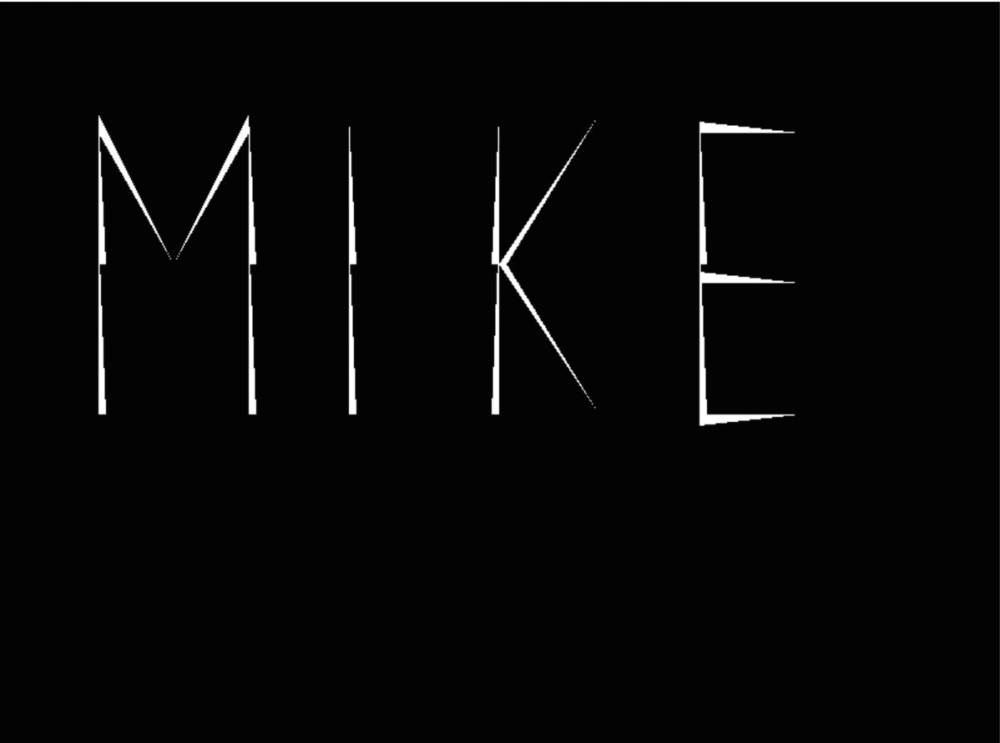
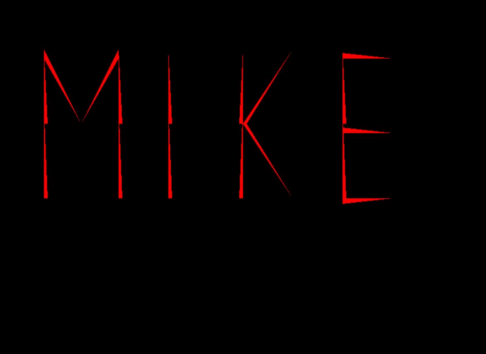
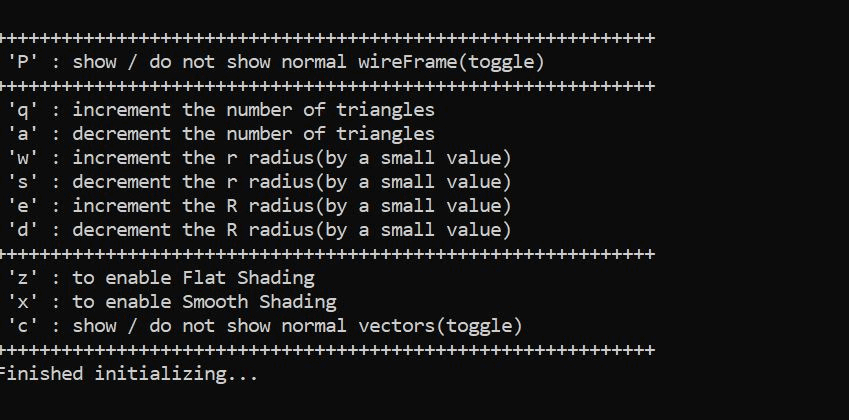
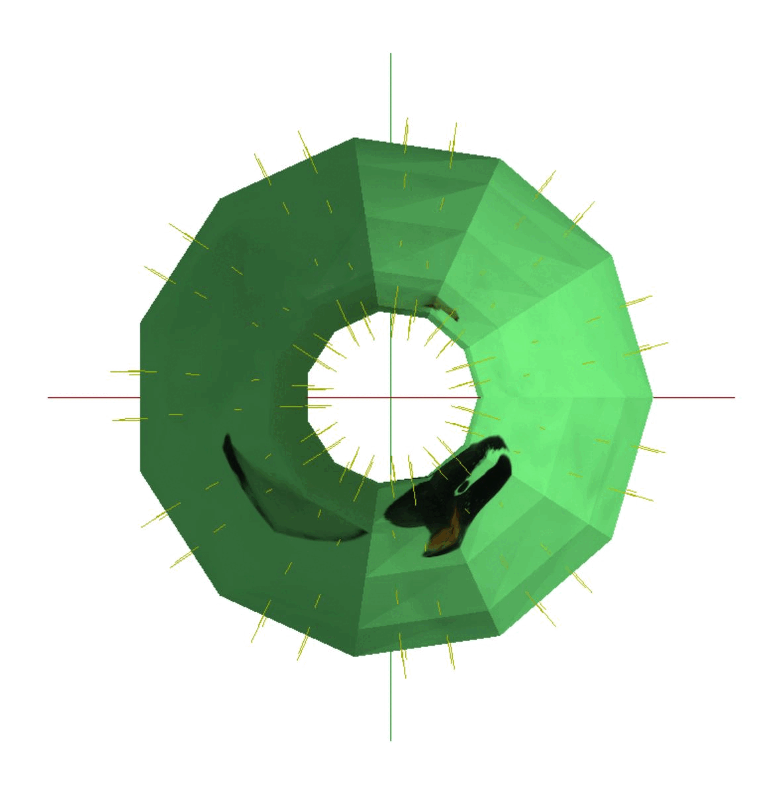
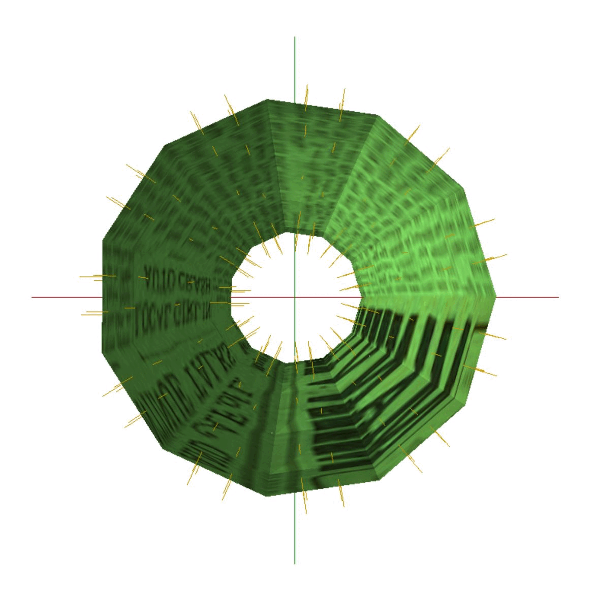
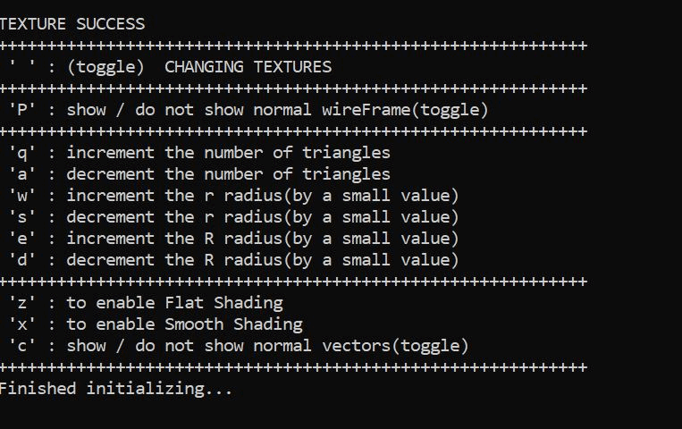

# UCM_CSE_170
### 
### Author: Mike Monokandilos

# Abstract

# Background 

# Problem(s) 

# Objectives 

# DEMOS

   
  <h2>Graphics Programming Assignment #1</h2>
  
  
   
   
  <h2>Graphics Programming Assignment #3</h2>
  
  
   
   
  <h2>Graphics Programming Assignment #4</h2>
  
  
  
  

